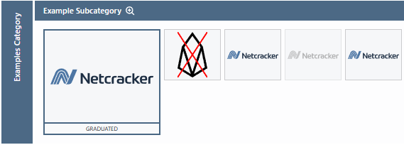

# Qubership-landscape-config application
This project extends/overrides base configuration of CNCF landscape https://github.com/cncf/landscape

## Project Structure
Main artifacts are
* \/added-items
* \/added-logos
* \/caddy-server
* \/docs
* \/landscape2-config
* compose.yml
* Dockerfile
* landscape.yml

### [added_items] folder
folder to contain additional configuration items in YAML format (*.yml).
The structure of content of the file must be same as base configuration file https://github.com/cncf/landscape/blob/master/landscape.yml

File can be organized into subfolders. During processing they will be collected recursively and will be merged
into base landscape.yml file.
All new configuration items will be added. All items which suites by category + subcategory + name will override
corresponding base configuration item properties.

### [added_logos] folder
Folder to contain additional icons in SVG format. In case files exist with same name as
in the base configuration repository https://github.com/cncf/landscape/tree/master/hosted_logos then
icon from this repository will be used instead of base file.

### [caddy-server] folder
Caddy server is used for HTTPS termination and basic-authorization when accessing production instance.
See https://caddyserver.com/docs/ for more details.

### [docs] folder
This folder is use to store pictures for this README.md documentation.

### [landscape2-config] folder
Contains configuration file for the "landscape" application which is used in production.

### "compose.yml" file
Deployment descriptor for docker-compose

### "Dockerfile" file
Docker-file build descriptor which can be used both for production and local-development

# Contribution rules
## Intro
The CNCF landscape is a very useful start point for researching industry mature applications and framework.
But some time it requires to track research status or research results.
As such this project allows to mark CNCF items with necessary status.
By default "landscape.yml" is used to render landscape.In case you need to add changes into OOB configuration do follow:
1. Find item in the landscape.yml file and copy its configuration into buffer
2. Create new (or select existed) yml-file under "added-items" directory. The file may be placed under any number of sub-dirs.
3. Paste content of item into the selected yml file. The final content must remain same structure as original landscape.yml file, i.e.:
   ```yaml
   # yaml-language-server: $schema=https://raw.githubusercontent.com/cncf/landscape2/refs/heads/main/docs/config/schema/data.schema.json

    landscape:
    - category:
      name: Examples Category
      subcategories:
        - subcategory:
          name: Example Subcategory
          items:
            - item:
              name: Unique item name
              homepage_url: https://www.example.org
              repo_url: https://github.com/example
              logo: example.svg
              project: researching
              description: This item has no "project" field.
   ```
4. Do commit into feature branch and request pull-request into main-branch.


## Supported statuses
Each configuration item can be rendered differently. The style depends on the "project" attribute value.
Following values are supported:

| property value     | supported by   | result                                                       |
|--------------------|----------------|--------------------------------------------------------------|
| \<absent\>         | landscape2 app | the item will be rendered as usual, small icon size, colored |
| graduated          | landscape2 app | big icon size, colored                                       |
| sandbox            | landscape2 app | small icon size, colored                                     |
| archived           | landscape2 app | small icon size, gray-colored                                |
| reject or rejected | conf-processor | small icon size, colored, covered with red cross             |
| researching       | conf-processor | small icon size, colored, surrounded with orange rectangle   | 
So, "sandbox" and "\<absent\>" are rendered similar. The difference is - that "sandbox"-ed item has "SANDBOX" label and may be quickly filtered.

See example below: <br>


## Deployment
All commits to "main" branch are automatically deployed to production instance. Approximate deployment time is ~one minute.

## Local build and run
The application is prepared ti be built and run using docker containerization. All steps: compilation, configuration and setup are packed inside docker container.
### Step1: build docker image
sudo docker build . -t IMAGE_NAME:0.0.0 --no-cache

### Step2: run docker image locally (no https is used)
sudo docker run -d -p 8888:80 IMAGE_NAME:0.0.0

